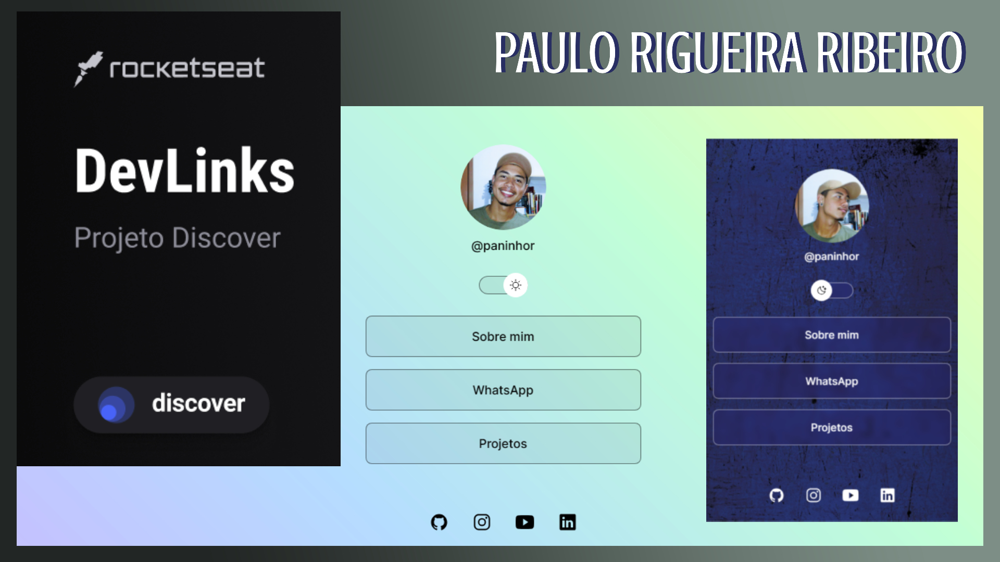

<h1 align="center"> LinkTree's Paulo Rigueira </h1>

Projeto realizado durante o curso Discover da Rocketseat ministrado pelo Mayk Brito

  <a href="#-tecnologias">Tecnologias</a>&nbsp;&nbsp;&nbsp;|&nbsp;&nbsp;&nbsp;
  <a href="#-projeto">Projeto</a>&nbsp;&nbsp;&nbsp;|&nbsp;&nbsp;&nbsp;
  <a href="#-layout">Layout</a>&nbsp;&nbsp;&nbsp;

  

 

## 🚀 Tecnologias

Esse projeto foi desenvolvido com as seguintes tecnologias:

- HTML e CSS
- JavaScript
- Git e Github
- Figma

## 💻 Projeto

Local onde ficam armazenadas informações para quem deseja entrar em contato com Paulo Rigueira.

## 🔖 Layout

Este projeto está armazenado no GitHub podendo ter acesso através do link:
https://paulorigueira.github.io/linktree/

Feito com muito carinho e decicação por Paulo Rigueira Ribeiro.